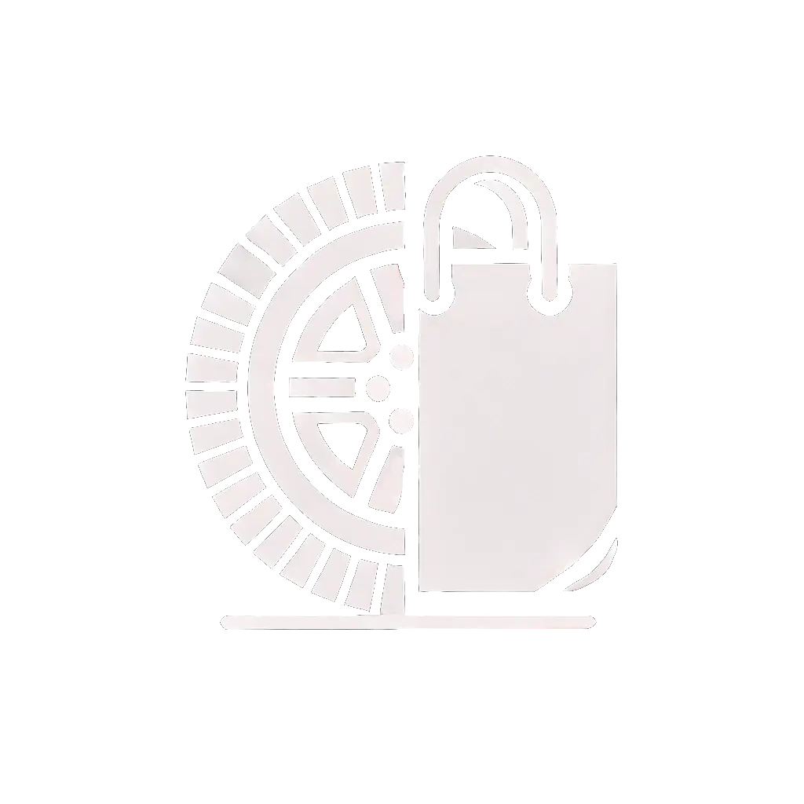

<!-- Improved compatibility of back to top link: See: https://github.com/NoahFsc/IUT-SAE-S5/pull/73 -->
<a id="readme-top"></a>
<!--
*** Thanks for checking out the Best-README-Template. If you have a suggestion
*** that would make this better, please fork the repo and create a pull request
*** or simply open an issue with the tag "enhancement".
*** Don't forget to give the project a star!
*** Thanks again! Now go create something AMAZING! :D
-->


<!-- PROJECT SHIELDS -->
<!--
*** I'm using markdown "reference style" links for readability.
*** Reference links are enclosed in brackets [ ] instead of parentheses ( ).
*** See the bottom of this document for the declaration of the reference variables
*** for contributors-url, forks-url, etc. This is an optional, concise syntax you may use.
*** https://www.markdownguide.org/basic-syntax/#reference-style-links
-->
[![Contributors][contributors-shield]][contributors-url]
[![Stargazers][stars-shield]][stars-url]
[![Issues][issues-shield]][issues-url]
[![MIT License][license-shield]][license-url]


<!-- PROJECT LOGO -->
<br />
<div align="center">
  <a href="https://github.com/NoahFsc/IUT-SAE-S5">
    
  </a>

  <h3 align="center">AutoMarket</h3>

  <p align="center">
    Site de vente et enchères en ligne
    <br />
    <a href="https://github.com/NoahFsc/IUT-SAE-S5"><strong>Documentation »</strong></a>
    <br />
    <br />
    <a href="https://github.com/NoahFsc/IUT-SAE-S5">Voir la démo</a>
    ·
    <a href="https://github.com/NoahFsc/IUT-SAE-S5/issues/new?labels=bug&template=bug-report---.md">Signaler un bug</a>
    ·
    <a href="https://github.com/NoahFsc/IUT-SAE-S5/issues/new?labels=enhancement&template=feature-request---.md">Demander une fonctionnalité</a>
  </p>
</div>


<!-- TABLE OF CONTENTS -->
<details>
  <summary>Table des matières</summary>
  <ol>
    <li>
      <a href="#about-the-project">A propos du projet</a>
      <ul>
        <li><a href="#built-with">Créé avec</a></li>
      </ul>
    </li>
    <li>
      <a href="#getting-started">Démarrer</a>
      <ul>
        <li><a href="#prerequisites">Prérequis</a></li>
        <li><a href="#installation">Installation</a></li>
      </ul>
    </li>
    <li><a href="#contributing">Contributions</a></li>
    <li><a href="#license">Licence</a></li>
  </ol>
</details>


<!-- ABOUT THE PROJECT -->
## A propos du projet

AutoMarket est une plateforme innovante de vente et d'enchères en ligne dédiée aux voitures, permettant aux particuliers de vendre et d'acheter des véhicules en toute simplicité. Notre objectif est de rendre le processus de vente et d'achat de voitures aussi fluide et transparent que possible.

Voici pourquoi AutoMarket se distingue :

- **Facilité d'utilisation :** Une interface intuitive pour une expérience utilisateur optimale.
- **Sécurité :** Des transactions sécurisées pour protéger les acheteurs et les vendeurs.
- **Transparence :** Des enchères en temps réel et des évaluations honnêtes des véhicules.
- **Support :** Une équipe dédiée pour vous assister à chaque étape du processus.
Que vous soyez un vendeur cherchant à obtenir le meilleur prix pour votre voiture ou un acheteur à la recherche de la meilleure affaire, AutoMarket est la solution idéale pour vous.

### Créé avec

Cette section liste les principaux frameworks/bibliothèques utilisés pour démarrer votre projet.

* [![Laravel][Laravel.com]][Laravel-url]
* [![NodeJS][Node.js]][Node-url]
* [![Tailwind][TailwindCSS.com]][Tailwind-url]
* [![Livewire][Livewire.com]][Livewire-url]

<!-- GETTING STARTED -->
## Démarrer

Voici les instructions à suivre pour démarrer le projet en local.

### Prérequis


* npm
  ```sh
  npm install npm@latest -g
  ```
* Laravel Herd (de préférence)
* PHP >8.2

### Installation

_Voici comment installer le projet_

1. Cloner le dépôt
   ```sh
   git clone https://github.com/NoahFsc/IUT-SAE-S5
   ```
2. Installer les packages NPM
   ```sh
   npm i
   ```
3. Ouvrir une console à la racine du projet, et installer composer et ses dépendances
   ```sh
   composer install
   ```
   ```sh
   composer update
   ```
4. Copier le fichier `.env.example` et le renommer `.env`
5. Générer une nouvelle clé
   ```sh
   php artisan key:generate
   ```
6. Entrer ses identifiants MySQL
   ```sql
   DB_CONNECTION=mysql
   DB_HOST=127.0.0.1
   DB_PORT=3306
   DB_DATABASE=<entrez votre bdd>
   DB_USERNAME=root
   DB_PASSWORD=<entrez votre mdp>
   ```
7. Démarrer le projet avec
   ```sh
   npm run dev
   ```
8. Y accéder à l'adresse `http://nom-du-dossier.test` si vous utilisez Laravel Herd

<!-- CONTRIBUTING -->
## Contributions

Merci à tous ces collaborateurs pour leur travail sur la réalisation du projet :

<a href="https://github.com/NoahFsc/IUT-SAE-S5/graphs/contributors">
  
</a>

<!-- LICENSE -->
## Licence

Distribué sous la MIT License.


<!-- MARKDOWN LINKS & IMAGES -->
<!-- https://www.markdownguide.org/basic-syntax/#reference-style-links -->
[contributors-shield]: https://img.shields.io/github/contributors/NoahFsc/IUT-SAE-S5.svg?style=for-the-badge
[contributors-url]: https://github.com/NoahFsc/IUT-SAE-S5/graphs/contributors
[stars-shield]: https://img.shields.io/github/stars/NoahFsc/IUT-SAE-S5.svg?style=for-the-badge
[stars-url]: https://github.com/NoahFsc/IUT-SAE-S5/stargazers
[issues-shield]: https://img.shields.io/github/issues/NoahFsc/IUT-SAE-S5.svg?style=for-the-badge
[issues-url]: https://github.com/NoahFsc/IUT-SAE-S5/issues
[license-shield]: https://img.shields.io/github/license/NoahFsc/IUT-SAE-S5.svg?style=for-the-badge
[license-url]: https://github.com/NoahFsc/IUT-SAE-S5/blob/master/LICENSE.txt
[Laravel.com]: https://img.shields.io/badge/Laravel-FF2D20?style=for-the-badge&logo=laravel&logoColor=white
[Laravel-url]: https://laravel.com
[Node.js]: https://img.shields.io/badge/Node.js-339933?style=for-the-badge&logo=nodedotjs&logoColor=white
[Node-url]: https://nodejs.org
[TailwindCSS.com]: https://img.shields.io/badge/TailwindCSS-06B6D4?style=for-the-badge&logo=tailwindcss&logoColor=white
[Tailwind-url]: https://tailwindcss.com
[Livewire.com]: https://img.shields.io/badge/Livewire-4E56A6?style=for-the-badge&logo=livewire&logoColor=white
[Livewire-url]: https://livewire.laravel.com
